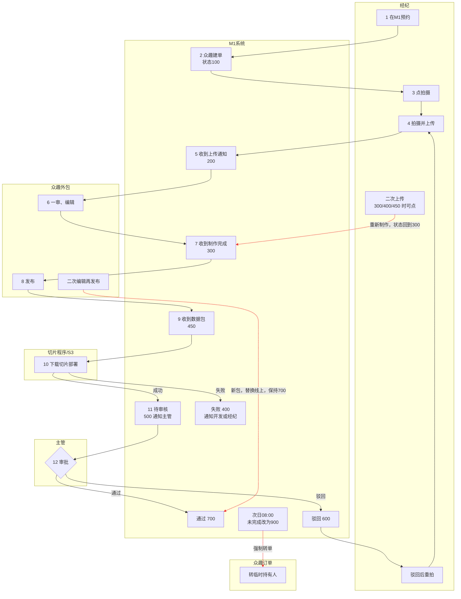
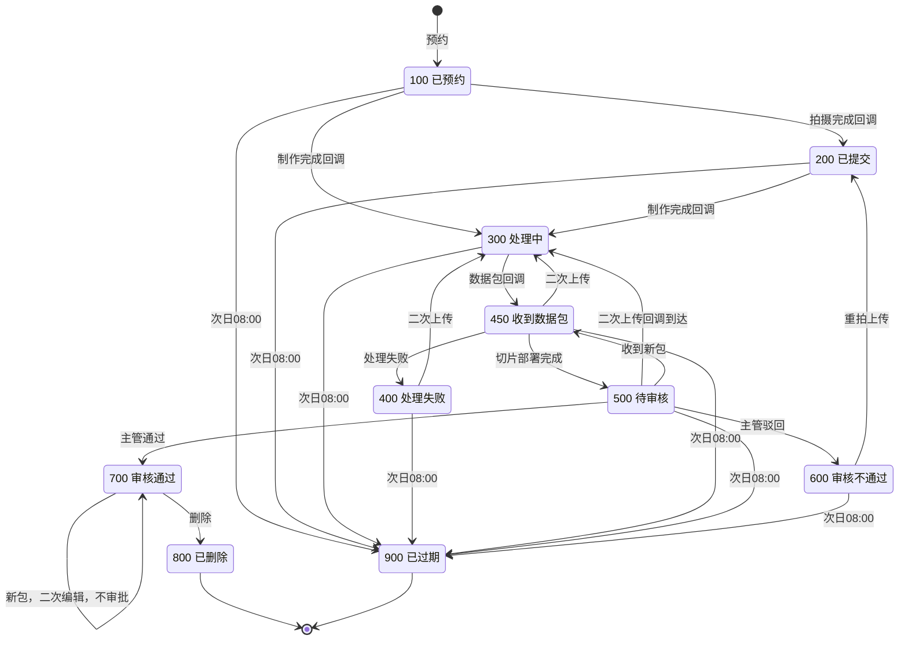
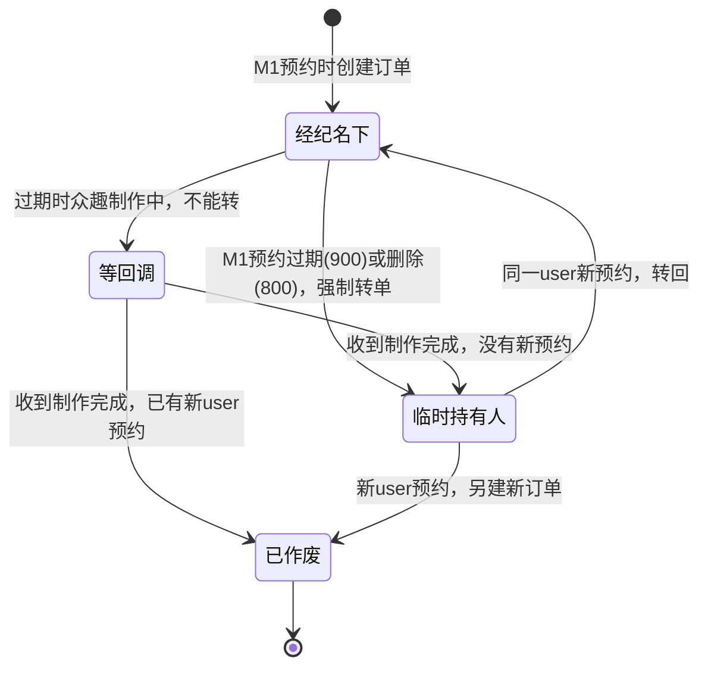

# 流程图

## 1. 整体流程（泳道，单图）
主线为数字 1–12；红色虚线为三种例外：二审通过后修改、08:00 过期转单、二次上传。

```mermaid
flowchart TB
    subgraph 经纪
        A1[1 在M1预约]
        A2[3 点拍摄]
        A3[4 拍摄并上传]
        A4[驳回后重拍]
        A5[二次上传<br/>300/400/450 时可点]
    end

    subgraph M1系统
        M1[2 众趣建单<br/>状态100]
        M2[5 收到上传通知<br/>200]
        M3[7 收到制作完成<br/>300]
        M4[9 收到数据包<br/>450]
        M5[11 待审核<br/>500 通知主管]
        M6[通过 700]
        M7[驳回 600]
        M8[失败 400<br/>通知开发或经纪]
        MX[次日08:00<br/>未完成改为900]
    end

    subgraph 众趣外包
        W1[6 一审、编辑]
        W2[8 发布]
        W3[二次编辑再发布]
    end

    subgraph 切片程序/S3
        P1[10 下载切片部署]
    end

    subgraph 主管
        B1{12 审批}
    end

    subgraph 众趣订单
        Z1[转临时持有人]
    end

    A1 --> M1 --> A2 --> A3 --> M2 --> W1 --> M3 --> W2 --> M4 --> P1
    P1 -->|成功| M5 --> B1
    P1 -->|失败| M8
    B1 -->|通过| M6
    B1 -->|驳回| M7 --> A4 --> A3

    W3 -.->|新包，替换线上，保持700| M6
    MX -.->|强制转单| Z1
    A5 -.->|重新制作，状态回到300| M3

    linkStyle 16,17,18 stroke:#e33,stroke-width:2px
```

> 注：按最新确认，经纪可点二次上传的状态为 300/400/450，回调到达时的处理见《需求说明》4.2。

## 2. M1 预约状态（单条预约生命周期）

```mermaid
stateDiagram-v2
    [*] --> S100: 预约
    S100: 100 已预约
    S200: 200 已提交
    S300: 300 处理中
    S400: 400 处理失败
    S450: 450 收到数据包
    S500: 500 待审核
    S600: 600 审核不通过
    S700: 700 审核通过
    S800: 800 已删除
    S900: 900 已过期

    S100 --> S200: 拍摄完成回调
    S100 --> S300: 制作完成回调
    S200 --> S300: 制作完成回调
    S300 --> S450: 数据包回调
    S450 --> S500: 切片部署完成
    S450 --> S400: 处理失败
    S400 --> S300: 二次上传
    S450 --> S300: 二次上传
    S500 --> S300: 二次上传回调到达
    S500 --> S700: 主管通过
    S500 --> S600: 主管驳回
    S500 --> S450: 收到新包
    S600 --> S200: 重拍上传
    S700 --> S700: 新包，二次编辑，不审批
    S700 --> S800: 删除

    S100 --> S900: 次日08:00
    S200 --> S900: 次日08:00
    S300 --> S900: 次日08:00
    S400 --> S900: 次日08:00
    S450 --> S900: 次日08:00
    S500 --> S900: 次日08:00
    S600 --> S900: 次日08:00

    S800 --> [*]
    S900 --> [*]
```

## 3. 众趣订单归属（跨多条 M1 预约）

```mermaid
stateDiagram-v2
    [*] --> 经纪名下: M1预约时创建订单
    经纪名下 --> 临时持有人: M1预约过期(900)或删除(800)，强制转单
    经纪名下 --> 等回调: 过期时众趣制作中，不能转
    等回调 --> 临时持有人: 收到制作完成，没有新预约
    等回调 --> 已作废: 收到制作完成，已有新user预约
    临时持有人 --> 经纪名下: 同一user新预约，转回
    临时持有人 --> 已作废: 新user预约，另建新订单
    已作废 --> [*]
```
